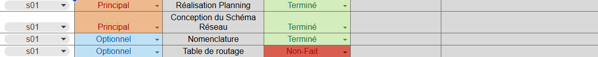
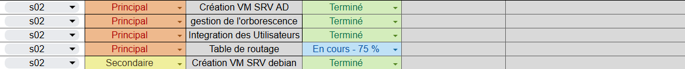
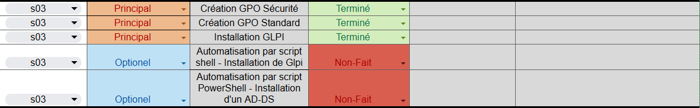
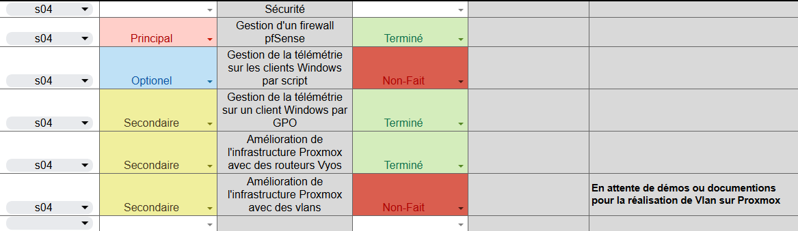
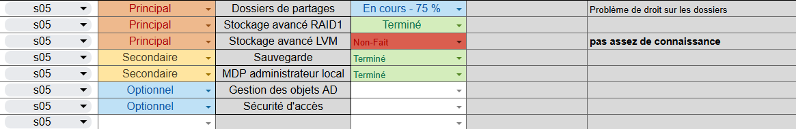
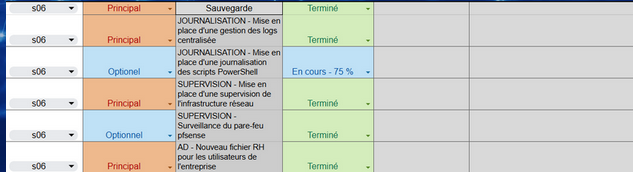
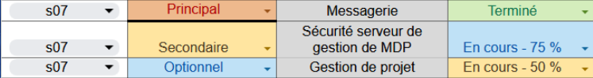
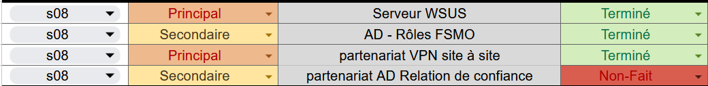
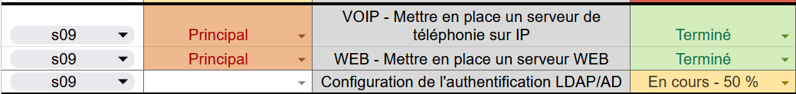

## TSSR-2409-JAUNE-P3-G2-BuildYourInfra-EcoTechSolutions
# Projet de Mise en Place d'une Infrastructure Réseau pour EcoTech Solutions

# I. Description
Ce projet consiste à concevoir et mettre en place une nouvelle **infrastructure réseau** pour **EcoTech Solutions**, une entreprise innovante basée à Bordeaux, spécialisée dans le développement de solutions **IoT** pour la gestion de l'énergie et des ressources naturelles. 

L'objectif est de moderniser l'infrastructure réseau actuelle, qui repose sur des équipements de base (Wi-Fi via une box FAI et des répéteurs), afin de mieux répondre aux exigences de sécurité, de performance et de croissance future de l'entreprise.
Les principaux objectifs du projet incluent :
- Définir les besoins techniques et fonctionnels.
- Proposer un **schéma réseau prévisionnel** (choix du matériel, adresses IP, serveur, etc.).
- Installer et configurer des équipements réseau adaptés (switchs, points d'accès, serveurs).
- Améliorer la sécurité du réseau (gestion des identités, VPN, etc.).
- Ajouter des fonctionnalités de redondance et de sauvegarde des données.
L'infrastructure actuelle souffre de plusieurs limitations (manque de sécurité, absence de redondance, etc.), ce qui justifie le besoin de cette nouvelle infrastructure.

# II. Introduction - Mise en contexte
Ce projet a été réalisé à trois, Damien, Arnaud et Marilyn, dans un laboratoire virtuel hébergé sur Proxmox. Sur ce laboratoire ont été installées et configurées des machines virtuelles et conteneur sous différents systèmes d'exploitation. 

# III. Rôles de chaque membre / objectifs
## Sprint 1
- Product Owner : Arnaud
- Scrum Master : Damien
- Développeuse : Marilyn
 
## Sprint 2
- Product Owner : Marilyn
- Scrum Master : Arnaud
- Développeur : Damien
   
## Sprint 3
- Product Owner : Damien
- Scrum Master : Marilyn
- Développeur : Arnaud
   
## Sprint 4
- Product Owner : Arnaud
- Scrum Master : Damien
- Développeuse : Marilyn
   
## Sprint 5
- Product Owner : Marilyn
- Scrum Master : Arnaud
- Développeur : Damien
   
## Sprint 6
- Product Owner : Marilyn
- Scrum Master : Damien
- Développeur : Arnaud \
   
## Sprint 7
- Product Owner : Damien
- Scrum Master : Arnaud
- Développeuse : Marilyn \
   

## Sprint 8
- Product Owner : Marilyn
- Scrum Master : Damien
- Développeur : Arnaud
   

## Sprint 9
- Product Owner : Arnaud
- Scrum Master : Marilyn
- Développeur : Damien
  

 ## Sprint 10
 - Product Owner : Damien
 - Scrum Master : Arnaud
 - Développeuse : Marilyn
  

 ## Sprint 11
 - Product Owner : Marilyn
 - Scrum Master : Damien
 - Développeur : Arnaud
   

## Sprint 12
 - Product Owner : Arnaud
 - Scrum Master : Marilyn
 - Développeur : Damien
  

 # IV. Choix techniques
 ## Les matériels et leurs rôles
 

1) **DORYPHORE**
    * Template : `Windows Server 2022` / Type : `VM`.
    * Configuration IP : `10.10.255.1/24` / Passerelle : `10.10.255.254` / Carte réseau : `vmbr555`.
    * Hard Disk : `1 HDD 32GO` 
    * Processeur : `4`.
    * RAM : `8Go`.
    * Fonction : `DHCP` / `DNS` / `ADDS`.

2) **OLIBRIUS**
    * Template : `Windows Server 2022` / Type : `VM`.
    * Configuration IP : `10.10.255.2/24` / Passerelle : `10.10.255.254` / Carte réseau : `vmbr555`.
    * Hard Disk : `1 HDD 32GO` 
    * Processeur : `2`.
    * RAM : `2Go`.
    * Fonction : `Contrôleur de domaine secondaire FSMO>RID`.

3) **BIDULE**
    * Template : `Windows Server 2022` / Type : `VM`.
    * Configuration IP : `10.10.255.13/24` / Passerelle : `10.10.255.254` / Carte réseau : `vmbr555`.
    * Hard Disk : `1 HDD 32GO` 
    * Processeur : `2`.
    * RAM : `4Go`.
    * Fonction : `Contrôleur de domaine secondaire FSMO>Emulateur PDC`.

4) **MAMELOUK**
    * Template : `FreeBSD` / Type : `VM`.
    * Configuration IP : `10.0.0.3/29` / Carte réseau : `vmbr1`.
    * Configuration IP : `10.10.254.254/24` / Carte réseau : `vmbr555`.
    * Configuration IP : `10.12.255.254/16` / Carte réseau : `vmbr570`.
    * Hard Disk : `1 HDD 10GO` 
    * Processeur : `2`.
    * RAM : `2Go`.
    * Fonction : `FIREWALL`.

5) **BOUGRE**
    * Template : `Debian 12` / Type : `CT`.
    * Configuration IP : `10.10.255.3/24` / Passerelle : `10.10.255.254` / Carte réseau : `vmbr555`.
    * Hard Disk : `1 HDD 32GO` 
    * Processeur : `1`.
    * RAM : `4Go`.
    * Fonction : `GLPI / SSH`.

6) **HURLUBERLU**
    * Template : `Debian 12` / Type : `CT`.
    * Configuration IP : `10.10.255.7/24` / Passerelle : `10.10.255.254` / Carte réseau : `vmbr555`.
    * Hard Disk : `1 HDD 32GO` 
    * Processeur : `4`.
    * RAM : `8Go`.
    * Fonction : `Graylog`.

7) **CANAILLE**
    * Template : `Debian 12` / Type : `CT`.
    * Configuration IP : `10.10.255.8/24` / Passerelle : `10.10.255.254` / Carte réseau : `vmbr555`.
    * Hard Disk : `1 HDD 32GO` 
    * Processeur : `4`.
    * RAM : `1Go`.
    * Fonction : `Zabbix`.

8) **ACCAPAREUR**
    * Template : `Debian 12` / Type : `CT`.
    * Configuration IP : `10.10.255.9/24` / Passerelle : `10.10.255.254` / Carte réseau : `vmbr555`.
    * Hard Disk : `1 HDD 32GO` 
    * Processeur : `1`.
    * RAM : `1Go`.
    * Fonction : `Serveur REDMINE`.

9) **IVROGNE**
    * Template : `Debian 12` / Type : `CT`.
    * Configuration IP : `10.10.255.10/24` / Passerelle : `10.10.255.254` / Carte réseau : `vmbr555`.
    * Hard Disk : `1 HDD 20GO` 
    * Processeur : `1`.
    * RAM : `4Go`.
    * Fonction : `Serveur de Mail / iRedMail`.

10) **FLIBUSTIER**
    * Template : `Debian 12` / Type : `CT`.
    * Configuration IP : `10.10.255.14/24` / Passerelle : `10.10.255.254` / Carte réseau : `vmbr555`.
    * Hard Disk : `1 HDD 20GO` 
    * Processeur : `1`.
    * RAM : `2Go`.
    * Fonction : `Serveur de Téléphonie / FreePBX`.

11) **COLOQUINTE**
    * Template : `Debian 12` / Type : `CT`.
    * Configuration IP : `10.10.255.11/24` / Passerelle : `10.10.255.254` / Carte réseau : `vmbr555`.
    * Hard Disk : `1 HDD 8GO` 
    * Processeur : `1`.
    * RAM : `512 Mo`.
    * Fonction : `Serveur de gestion de mot de passe / Passbolt`.

12) **NYCTALOPE**
    * Template : `Windows Server 2022` / Type : `VM`.
    * Configuration IP : `10.10.255.5/24` / Passerelle : `10.10.255.254` / Carte réseau : `vmbr555`.
    * Hard Disk : `1 HDD 32GO` / `1 HDD 50GO` / `1 HDD 50GO`
    * Processeur : `2`.
    * RAM : `4 Go`.
    * Fonction : `SERVEUR DE STOCKAGE / Raid1`.

13) **ESCROC**
    * Template : `Windows Server 2022` / Type : `VM`.
    * Configuration IP : `10.10.255.6/24` / Passerelle : `10.10.255.254` / Carte réseau : `vmbr555`.
    * Hard Disk : `1 HDD 32GO` / `1 HDD 50GO` / `1 HDD 50GO`
    * Processeur : `2`.
    * RAM : `4 Go`.
    * Fonction : `RAID1 STOCKAGE AVANCE`.

14) **ANACOLUTHE**
    * Template : `Windows Server 2022` / Type : `VM`.
    * Configuration IP : `10.10.255.12/24` / Passerelle : `10.10.255.254` / Carte réseau : `vmbr555`.
    * Hard Disk : `1 HDD 32GO`
    * Processeur : `2`.
    * RAM : `4 Go`.
    * Fonction : `Windows Server Update Services`.

15) **PATAPOUF**
    * Template : `Debian 12` / Type : `CT`.
    * Configuration IP : `10.12.1.1/16` / Passerelle : `10.10.255.254` / Carte réseau : `vmbr555`.
    * Hard Disk : `1 HDD 8GO` 
    * Processeur : `1`.
    * RAM : `512 Mo`.
    * Fonction : `Serveur Web /Apache2, SSH`.
    
16) **G2-PC-ADMIN-000**
    * Template : `Windows 10` / Type : `VM`.
    * Configuration IP : `10.10.255.69/16` / Passerelle : `10.10.1.1` / Carte réseau : `vmbr555`.
    * Hard Disk : `1 HDD 50GO` 
    * Processeur : `4`.
    * RAM : `8 Go`.
    * Fonction : `PC Administration`.

17) **G2-SNORT-TEST**
    * Template : `Ubuntu 24.04-lts` / Type : `VM`.
    * Configuration IP : `10.10.1.2/16` / Passerelle : `10.10.1.1` / Carte réseau : `vmbr555`.
    * Hard Disk : `1 HDD 32GO` 
    * Processeur : `1`.
    * RAM : `4 Go`.
    * Fonction : `SNORT IDS`.

18) **G2-WINCLIN-TEST**
    * Template : `Windows 10` / Type : `VM`.
    * Configuration IP : `DHCP` / Passerelle : `10.10.1.1` / Carte réseau : `vmbr555`.
    * Hard Disk : `1 HDD 50GO` 
    * Processeur : `2`.
    * RAM : `4 Go`.
    * Fonction : `CLIENT`.

19) **G2-WINCLIN-TEST3**
    * Template : `Windows 10` / Type : `VM`.
    * Configuration IP : `DHCP` / Passerelle : `10.10.1.1` / Carte réseau : `vmbr555`.
    * Hard Disk : `1 HDD 50GO` 
    * Processeur : `2`.
    * RAM : `4 Go`.
    * Fonction : `CLIENT`.

20) **G2-Vyos-R1**
    * Template : `Vyos` / Type : `VM`.
    * Configuration IP : `10.10.0.1/21` / Carte réseau : `vmbr555`.
    * Configuration IP : `10.10.0.2/21` / Carte réseau : `vmbr555`.
    * Configuration IP : `10.10.255.254/24` / Carte réseau : `vmbr555`.
    * Configuration IP : `10.10.254.253/24` / Carte réseau : `vmbr555`.
    * Hard Disk : `1 HDD 4GO` 
    * Processeur : `2`.
    * RAM : `1 Go`.
    * Fonction : `Routeur`.

 # V. Difficultés / Solutions

 # VII. Conclusion

 # VI. Suggestions d'amélioration

  

