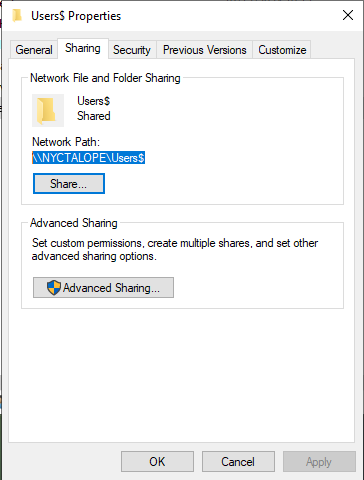

### PREPARATION DU DOSSIER DE PARTAGE AVEC LES ENTREES D’AUTORISATIONS

- Ouvrez une session administrateur sur votre serveur Windows 2022
- dans le lecteur E:\ aller au dossier « Users ».
- Partagez ce dossier et ajouter le symbole dollar « **$** » après le nom de partage pour cacher le nom de partage :\
 
- Cliquez sur « Autorisations »
- Supprimez le groupe « Averyone » des autorisations et cliquez le bouton « Ajouter » :\
 
- Cliquez le bouton « Avanced » :\

- Cliquez le bouton « Check Names » et sélectionnez « Administrator » et « Authenticated Users » :\ 

- Accordez un contrôle total sur ce partage pour les utilisateurs sélectionnés et validez vos choix :\

- Le dossier est maintenant partagé :\
 
-  Cliquez l’onglet « Sécurity » et accédez aux réglages avancés en cliquant le bouton « Avanced » :\
-  Cliquez le bouton `Disable inheritance` :\

-  Cliquez sur `Remove all inherited permissions from this object` :\

-  Une fois la liste des entrées d’autorisations vide, cliquez le bouton `add` :\
  
- Nous allons maintenant devoir ajouter des autorisations spécifiques :\
- Cliquez sur le lien `Select a principal`:\
 
- Taper « CREATOR OWNER », cliquer `OK`:\

- selectionner `Full control`, puis `OK`,\

- Cliquez sur le lien `Select a principal`:\

- Taper « SYSTEM », cliquer `OK`:\

- selectionner `Full control`, puis `OK`,\
  
- Cliquez sur le lien `Select a principal`:\

- Taper « Authenticated Users», cliquer `OK`:\

- selectionner `Full control`, puis `OK`,\
 

 
### CREATION DE LA STRATEGIE DE GROUPE (GPO)

a) Création automatique du dossier utilisateur dans le partage « Users$ »
- Ouvrez le gestionnaire de serveur et cliquez « tools » - « Group Policy Management »
- Faites un clic droit sur votre nom de domaine et cliquez « Create e GPO in this domain, and Link it here… » :
- Nommer GPO \

- Faites un clic droit sur votre objet GPO créé et cliquez « Edit »
- Dans « User Configuration », déployez la rubrique « Windows Setting »
- Cliquez « Folder » , « New », « Folder ».\

- Complétez la fenêtre en spécifiant bien l’emplacement où seront créés les dossiers utilisateurs (cet
emplacement correspond à l’espace de partage précédemment configuré):\

- Cliquez l’onglet « Common » et activez la case « Run in logged-on user's security context (user policy option) » et validez vos choix :\

b) Mappage du dossier personnel de l’utilisateur à l’ouverture de session

- Sélectionnez « Drive Maps » et faites un clic droit « New » - « Mapped Drive » :\

- Complétez la fenêtre ainsi : \
 ``ATTENTION, il est important, ici, de bien
respecter la syntaxe !
Indiquez le nom de partage vers le dossier
« utilisateurs » tel qu’il a été défini au
départ et n’oubliez pas d’ajouter le $
Ajoutez la variable « %LogonUser% `` \

- Cliquez l’onglet « Common » et activez la case « Run in logged-on user's security context (user policy option) » et validez vos choix :\
 

