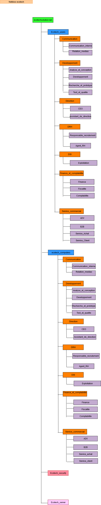

# SPRINT 1 USER GUIDE
## Schéma réseau

## Nomenclature

## Adressage
### Réseau: 10.10.0.0/16

|  CIDR |  Hôtes |  54 personnes  |  Département |  Adresse de réseau |  Adresse de broadcast |  Adresse de début de plage |  Adresse de fin de plage |  Masque de sous réseau | Vlan |
|-------|--------|----------------|--------------|--------------------|-----------------------|----------------------------|---------------------------|------------------|---------|
|  32-5 = 27 |  2^5-2 = 30 |  15 |  Service Commercial |  10.10.1.0/27 |  10.10.1.31 |  10.10.1.1 |  10.10.1.30 |  255.255.255.224 |  **VLAN10** |
|  32-5 = 27 |  2^5-2 = 30 |  14 |  Développement |  10.10.2.0/27 |  10.10.2.31 |  10.10.2.1 |  10.10.2.30 |  255.255.255.224 |  **VLAN20** |
|  32-4 = 28 |  2^4-2 = 14 |  9 |  Communication |  10.10.3.0/28 |  10.10.3.15 |  10.10.3.1 |  10.10.3.14 |  255.255.255.240 | **VLAN30** |
|  32-4 = 28 |  2^4-2 = 14 |  8 |  Finance et Compta |  10.10.4.0/28 |  10.10.4.15 |  10.10.4.1 |  10.10.4.14 |  255.255.255.240 | **VLAN40** |
|  32-4 = 28 |  2^4-2 = 14 |  6 |  DSI |  10.10.5.0/28 |  10.10.5.15 |  10.10.5.1 |  10.10.5.14 |  255.255.255.240 |  **VLAN50** |
|  32-3 = 29 |  2^3-2 = 6 |  3 |  Direction RH |  10.10.6.0/29 |  10.10.6.7 |  10.10.6.1 |  10.10.6.6 |  255.255.255.248 |  **VLAN60** |
|  32-3 = 29 |  2^3-2 = 6 |  2 |  Direction |  10.10.7.0/29 |  10.10.7.7 |  10.10.7.1 |  10.10.7.6 |  255.255.255.248 |  **VLAN70** |

### Materiels

    
    - 2 switchs utilisateur avec 7 Vlans
    - 1 switch serveur
    - 2 routeur
    - 1 pc par utilisateur, par département
    - 1 serveur DHCP/AD/DNS	
    - 1 serveur GLPI / SSH
    - 1 serveur PfSense
	  - 1 serveur de stockage	

   
## Table de Routage

### R1

| Adresse de Réseau |  Masque de réseau |  Adresse Passerelle |  Interface Local |
|-----------------|---------------------|-------------------------|---------------|
| 10.10.1.0 | 255.255.0.0 | on-link (connexion direct) |  10.10.0.1 |  
| 10.10.2.0 |  255.255.0.0 |  on-link (connexion direct) |  10.10.0.1 |
| 10.10.3.0 |  255.255.0.0 |  on-link (connexion direct) |  10.10.0.2 |
| 10.10.4.0 |  255.255.0.0 |  on-link (connexion direct) |  10.10.0.2 |
| 10.10.5.0 |  255.255.0.0 |  on-link (connexion direct) |  10.10.0.2 |  
| 10.10.6.0 |  255.255.0.0 |  on-link (connexion direct) |  10.10.0.2 |
| 10.10.7.0 |  255.255.0.0 |  on-link (connexion direct) |  10.10.0.2 |
| 172.16.1.0 |  255.255.255.248 |  On-link (connexion direct) |  172.16.1.1 |
| 10.10.255.0 |  255.255.255.0 |  On-link (connexion direct)|  10.10.255.254|
| 10.10.254.0 |  255.255.255.0|  172.16.1.2 |  172.16.1.1 |  
| 0.0.0.0 |  0.0.0.0 |  172.16.3.1 |  172.16.1.2 |

### R2

|  Adresse de Réseau |  Masque de réseau |  Adresse Passerelle | Interface Local |
|-----------------|---------------------|-------------------------|---------------|
|  10.10.254.0 |  255.255.255.0 |  On-link (connexion direct) |  10.10.254.253 |
|  172.16.1.0 |  255.255.255.248 |  On-link (connexion direct) |  172.16.1.2 |
|  10.10.1.0 |  255.255.255.0 |  172.16.1.1 |  172.16.1.2 |
|  10.10.2.0 |  255.255.255.0 |  172.16.1.1 |  172.16.1.2 |
|  10.10.3.0 |  255.255.255.0 |  172.16.1.1 |  172.16.1.2 |
|  10.10.4.0 |  255.255.255.0 |  172.16.1.1 |  172.16.1.2 |
|  10.10.5.0 |  255.255.255.0 |  172.16.1.1 |  172.16.1.2 |
|  10.10.6.0 |  255.255.255.0 |  172.16.1.1 |  172.16.1.2 |
|  10.10.7.0 |  255.255.255.0 |  172.16.1.1 |  172.16.1.2 |
|  0.0.0.0 |  0.0.0.0 |  Iterface pare-feu |  10.10.254.254 | 
