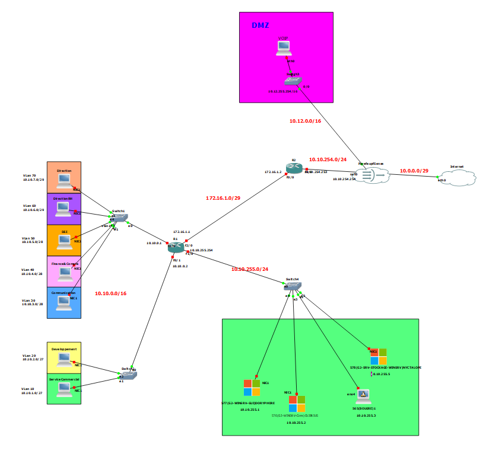
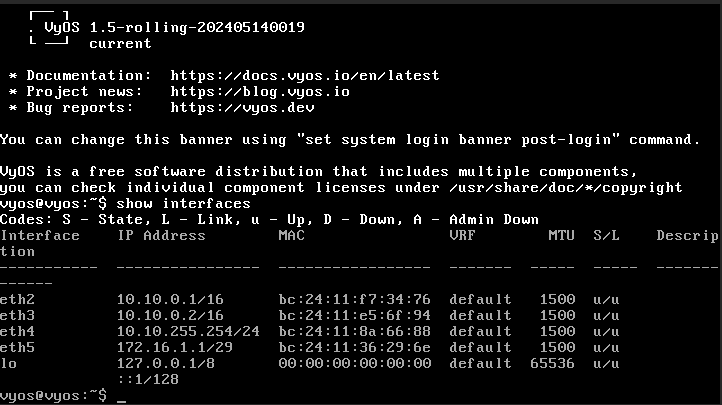
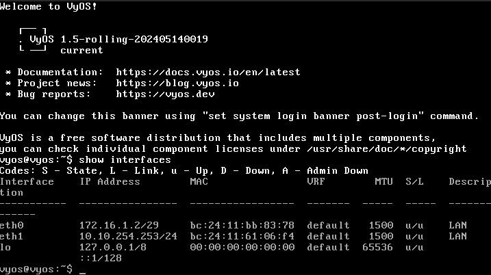
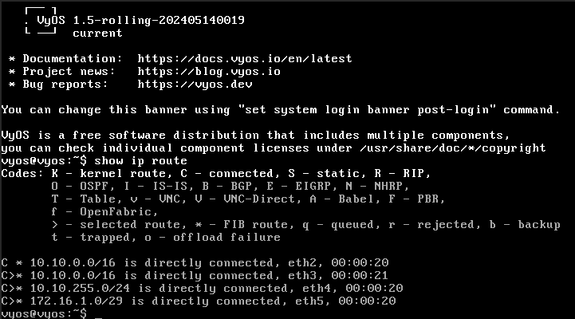
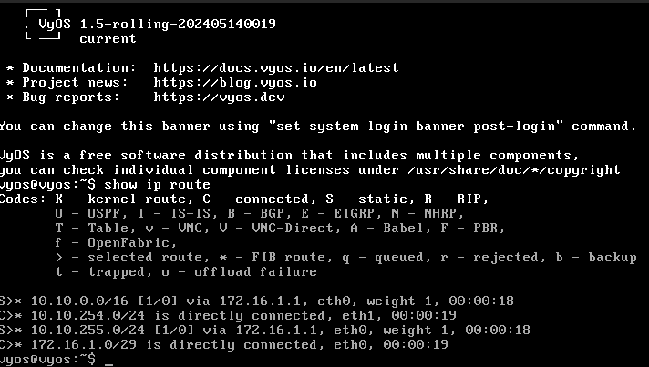

## Routeurs Vyos
#### R1
* Template : `Vyos-1.5` / Type : `VM`.
* Configuration IP : `10.10.10.1/16` / Carte réseau : `vmbr555`.
* Configuration IP : `10.10.10.2/16` / Carte réseau : `vmbr555`.
* Configuration IP : `10.10.255.254/16` / Carte réseau : `vmbr555`.
* Configuration IP : `172.16.1.1/29` / Carte réseau : `vmbr555`.
* Hard Disk : `1 HDD 4GO`  (Système) 
* Processeur : `2`.
* RAM : `512Mo`.
* Fonction : `Routeur`.

#### R2
* Template : `Vyos-1.5` / Type : `VM`.
* Configuration IP : `172.16.1.2/29` / Carte réseau : `vmbr555`.
* Configuration IP : `10.10.254.253/24` / Carte réseau : `vmbr555`.
* Hard Disk : `1 HDD 4GO`  (Système) 
* Processeur : `2`.
* RAM : `512Mo`.
* Fonction : `Routeur`.

### Sommaire

1) Configurations des cartes réseaux

2) Configuration du routage

3) FAQ : Solutions aux problèmes connus et communs liés à l'installation et à la configuration

### Mise en place et Configuration des Routeurs Vyos

Suite à l'installation et la configuration du Pare-feu, nous avons mis en place des Routeurs **Vyos**

Nous avons par la même occasion revu notre plan schématique du réseau, pour que celui-ci corresponde à la réalité

Une fois les routeurs installés, nous devons les parametrer

### Configuration des cartes réseaux

1. Au démarrage du Routeur, saisissez le Login `vyos` et le mot de passe `vyos`.

2. Accédez au mode de configuration avec la comande `conf`.

3. Vérifiez la présence des cartes réseaux avec la commande `run show interfaces`.

4. Pour paramètrer l'IP d'une carte réseau, utilisez la commande `set interfaces ethernet <nom de la carte> address <IP de la carte>` puis `commit` puis `save`.  
Par exemple, pour la carte `eth2` et l'`IP 10.10.8.10/29`, saisissez la commande `set interfaces ethernet eth2 address 10.10.8.10/29` puis `commit` puis `save`.

5. Sortez du Mode Configuration avec la commande `exit`.

6. Vérifiez vos paramètres avec la commande `show interfaces`.

Ce qui nous donne pour les différents Routeurs les interfaces suivantes :

Routeur R1

Routeur R2

### Configuration du Routage

1. De la même façon, une fois en mode Configuration, pour établir une règle de routage, utilisez la commande `set protocols static route <adresse de réseau à cibler> next-hop <adresse de la passerelle>` puis `commit` puis `save`.  
Par exemple, pour un routage vers le réseau `10.0.0.0/24`, saisissez la commande `set protocols static route 10.0.1.0/16 next-hop 10.10.0.1` puis `commit` puis `save`.

2. Sortez du Mode Configuration avec la commande `exit`.

3. Vérifiez vos paramètres avec la commande `show ip route`.

Nous aurons donc nos Routeurs configurés de la façon suivante : 

Routeur **R1**

| Adresse de Réseau |  Masque de réseau |      Adresse Passerelle    |  Interface Local |
|-------------------|-------------------|----------------------------|------------------|
|     10.10.1.0     |   255.255.0.0     | on-link (connexion direct) |    10.10.0.1     |  
|     10.10.2.0     |   255.255.0.0     | on-link (connexion direct) |    10.10.0.1     |
|     10.10.3.0     |   255.255.0.0     | on-link (connexion direct) |    10.10.0.2     |
|     10.10.4.0     |   255.255.0.0     | on-link (connexion direct) |    10.10.0.2     |
|     10.10.5.0     |   255.255.0.0     | on-link (connexion direct) |    10.10.0.2     |  
|     10.10.6.0     |   255.255.0.0     | on-link (connexion direct) |    10.10.0.2     |  
|     10.10.7.0     |   255.255.0.0     | on-link (connexion direct) |    10.10.0.2     |
|     172.16.1.0    |   255.255.255.248 | On-link (connexion direct) |    172.16.1.1    |
|     10.10.255.0   |   255.255.255.0   | On-link (connexion direct) |    10.10.255.254 |
|     10.10.254.0   |  255.255.255.0    |        172.16.1.2          |    172.16.1.1    |  
|     0.0.0.0       |      0.0.0.0      |        172.16.2.2          |    172.16.1.1    |

Routeur **R2****

| Adresse de Réseau |  Masque de réseau |     Adresse Passerelle     |  Interface Local  |
|-------------------|-------------------|----------------------------|-------------------|
|    10.10.254.0    |  255.255.255.0    | On-link (connexion direct) |   10.10.254.253   |
|    172.16.1.0     |  255.255.255.248  | On-link (connexion direct) |   172.16.1.2      |
|    10.10.1.0      |  255.255.255.0    |         172.16.1.1         |   172.16.1.2      |
|    10.10.2.0      |  255.255.255.0    |         172.16.1.1         |   172.16.1.2      |
|    10.10.3.0      |  255.255.255.0    |         172.16.1.1         |   172.16.1.2      |
|    10.10.4.0      |  255.255.255.0    |         172.16.1.1         |   172.16.1.2      |
|    10.10.5.0      |  255.255.255.0    |         172.16.1.1         |   172.16.1.2      |
|    10.10.6.0      |  255.255.255.0    |         172.16.1.1         |   172.16.1.2      |
|    10.10.7.0      |  255.255.255.0    |         172.16.1.1         |   172.16.1.2      |
|    0.0.0.0        |     0.0.0.0       |     Iterface pare-feu      |  10.10.254.254    | 

Vos Routeurs sont configurés.

## FAQ : Solutions aux problèmes connus et communs liés à l'installation et à la configuration

