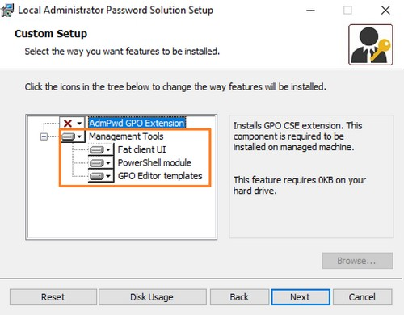
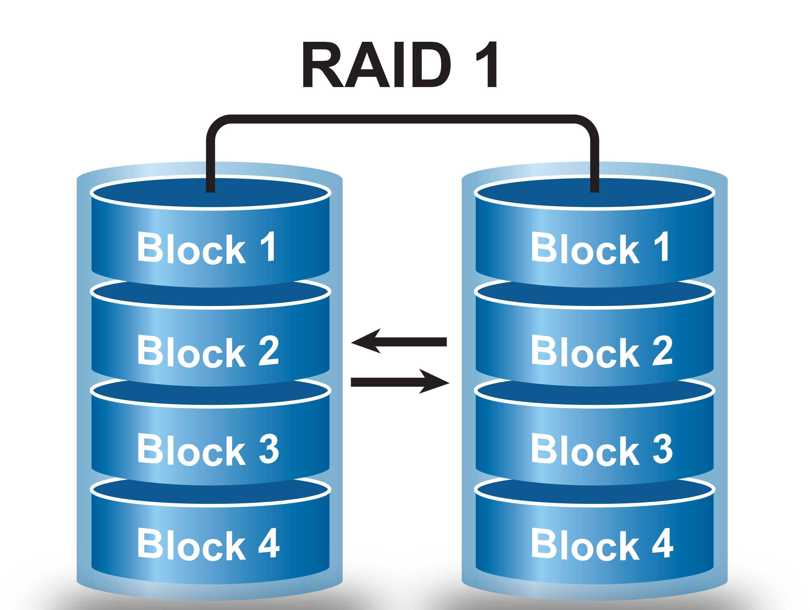

# Installation de LAPS 

## 1. Téléchargement des sources d'installation

Commencer par télécharger les sources d'installation sur le site de Microsoft en suivant cette adresse, [Téléchargement de LAPS](https://www.microsoft.com/en-us/download/details.aspx?id=46899). Attention à prendre la version **LAPS.x64.msi**.

Une fois les sources télécharger, lancer l'installation et sélectionner comme suit les fonctionnalités à installer.



## 2. Mise à jour du schéma AD

Sur le **Contrôleur de Domaine** avec le rôle **FSMO Maitre de schéma**, suivez la procédure comme expliquée ci-après.

Exécutez la commande suivante pour importer le module PowerShell de LAPS :
```Powershell
Import-Module AdmPwd.PS
```

Ensuite, exécuter la commande ci-dessous pour mettre à jour le schéma AD et assurez vous que le résultat `status` soit bien `succes:

```Powershell
Update-AdmPwdADSchema
```

## 3. Attribution des droit en écriture aux clients 

Afin que les postes clients puissent modifier leur mot de passe au sein de l'AD il faut leur accorder cette autorisation.

Il faut viser l'OU ou sont présent les postes clients, en saisissant la cmdlet suivante :
```Powershell
Set-AdmPwdComputerSelfPermission -OrgUnit "OU=Ecotech_Computers,DC=ecotechsolutions,DC=lan"
```

## 4. Ajout des autorisations aux groupe admin

Afin que seul les administrateurs puissent consulter les mots de passes et les modifier en cas de besoin, il faut leur donner les droits sur l'OU `Ecotech_Computers`, pour se faire saisissez les commandes suivantes.

```Powershell
Set-AdmPwdReadPasswordPermission -Identity "OU=Ecotech_Computers,DC=ecotechsolutions,DC=lan" -AllowedPrincipals "Grp_Ecotech_Admin_GG"
```

```Powershell
Set-AdmPwdResetPasswordPermission -Identity "OU=Ecotech_Computers,DC=ecotechsolutions,DC=lan" -AllowedPrincipals "Grp_Ecotech_Admin_GG"
```

## 5. Configuration du Magasin Central

Pour initialiser le Magasin Central, il faut commencer par copier les répertoires et fichiers du dossiers stocker en local vers le Magasin Central, pour se faire.

Copier le répertoire et l'intégralité de ses fichiers `.ADMX` et `.ADML` :
```Powershell
Copy-Item -Path "C:\Windows\PolicyDefinitions" -Destination "C:\Windows\SYSVOL\sysvol\ecotechsolutions.lan\Policies" -Recurse -Force
```

## 6. Création de la GPO de gestion de mot de passe LAPS

Dans la console **Group Policy Management**, créer une GPO nommée `GPO_Ecotech_C_LAPS-Conf_GG`. 

Dans la GPO aller configurer **Computer Configuration** > **Administrative Template** > **LAPS** 

**Password Settings** > **Enabled** > **Password Length 32** \
**Do not allow password exipration...** > **Enabled** \
**Enable local  admin password...** > **Enabled**

Supprimer le groupe **Authenticated Users** et ajouter le groupe **Domain Computers**. 

Modifier le statut de la GPO en cochant **User Configuration Settings Disabled** puis lier la GPO à l'OU **Ecotech_Computers**.

## 7. Déploiement de LAPS par GPO

Dans la console **Group Policy Management**, créer une GPO nommée `GPO_Ecotech_C_LAPS-Dpl_GG`. 

Dans la GPO aller configurer **Computer Configuration** > **Policies** > **Software Settings** > **Software installation** > **New** > **Package...** 

Chemin du répertoire pour les sources d'installation de **LAPS**
```
\\10.10.255.1\C$\Ecotech_Dossier\Logiciel
```

Supprimer le groupe **Authenticated Users** et ajouter le groupe **Domain Computers**. 

Modifier le statut de la GPO en cochant **User Configuration Settings Disabled** puis lier la GPO à l'OU **Ecotech_Computers**.


# Configuration d'un RAID 1 sur Windows Server 2022

## Prérequis
- **Disques** : Deux disques de 50 Go pour le RAID 1 et un disque de 32 Go indépendant.
- **Accès administrateur** : Nécessaire pour effectuer la configuration.

---

## Étape 1 : Accéder à Gestion des disques

1. **Ouvrir Gestion des disques sans raccourcis :**
   - Cliquez sur **Start** et tapez `Server Manager`, puis ouvrez-le.
   - Dans le **Server Manager**, allez dans **Tools > Computer Management**.
   - Dans **Computer Management**, sélectionnez **Storage > Disk Management**.

---

## Étape 2 : Préparer les disques

1. **Vérifiez les disques disponibles :**
   - `Disk 0` : 32 Go, restera indépendant.
   - `Disk 1` et `Disk 2` : 50 Go chacun, pour le RAID 1.

2. **Initialisez les disques de 50 Go :**
   - Si les disques de 50 Go sont marqués comme *Not Initialized* :
     - Faites un clic droit sur chaque disque > **Initialize Disk**.
     - Sélectionnez **GPT (GUID Partition Table)**.

---

## Étape 3 : Créer le RAID 1 

### Via Gestion des disques
1. **Créer un volume miroir :**
   - Faites un clic droit sur `Disk 1` > **New Mirrored Volume**.
   - Sélectionnez `Disk 2` comme second disque pour le miroir.

2. **Configurer le volume :**
   - Attribuez une lettre de lecteur (ex. `D:`).
   - Formatez le volume avec **NTFS**.
   - Terminez l’assistant.

3. **Vérifiez le RAID :**
   - Les deux disques apparaîtront comme un seul volume miroir dans **Disk Management**.
