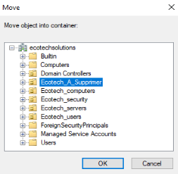
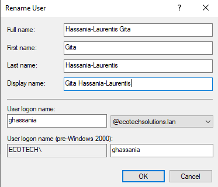

# SPRINT 6 INSTALL

## Mise à jour de l'AD

### Le département "Finance et Comptabilité" change de nom et s'appelle désormais  "Direction financière".
- Cette partie là a été traitée manuellement.
#### Renommer l'OU "Finance et Comptabilite".
- Selectioner l'OU "Finance et Comptabilite" et faire clic droit, puis `Rename`.\

- Renommer l'OU "Direction financiere".\

### Dans ce département, le service "Fiscalité" disparaît, et les collaborateurs intègrent le service "Finance".
- Cette partie là a été traitée manuellement.

#### Déplacer Compte Utilisateur.
- Sélectioner l'utilisateur et faire clic droit, puis `Move`.\

- Sélectionner l'OU où l'utilisateur doit être déplacé, puis OK.  \

#### Déplacer l'OU"Fiscalité" dans l'OU "Ecotech_A_Supprimer".
- Sélectioner l'OU "Fiscalité" et faire clic droit, puis `Move`.\

- Sélectionner l'OU "Ecotech_A_Supprimer" où il doit être déplacé, puis OK.  \

### Intégration des nouveaux utilisateurs.
- Nous avons utilisé un script avec un fichier CSV, les nouveaux entrants ont été intégrés à l'AD. \
[USER_Creation_Ecotechsolution.ps1](../Ressources/Scripts/USER_Creation_Ecotechsolution.ps1)\
[Liste_Employes_Entrant.csv](../Ressources/Scripts/Liste_Employes_Entrant.csv)

### Plusieurs collaborateurs ont quitté la société à la fin du mois dernier. Traiter leurs comptes AD ainsi que leurs données associées (s'il y en a).
#### Désactivation des comptes AD.
- Pour la désactivation des employés sortant nous avons d'abord créer un OU `Ecotech_A_Supprimer`, pour centraliser les utilisateurs.
- Pour traiter la désactivation et le déplacement dans cette OU nous passons par un script et un fichier csv. \
[USER_Désactivation_Ecotechsolution.ps1](../Ressources/Scripts/USER_Desactivation_Ecotechsolution.ps1)\
[Liste_Employes_Sortant.csv](../Ressources/Scripts/Liste_Employes_Sortant.csv)
- Vous Pouvez voire que les utilisateurs sont intégrés à l'OU "Ecotech_A_Supprimer", avec en description la date de désactivation.\

- l'OU `Ecotech_A_Supprimer` sera vidée une fois par mois via un script(en cours de réalisation), les dossiers personnels seront aussi supprimés.

### Des collaborateurs se sont marié. Traiter correctement leur nouveau nom.

- Cette partie là a été traitée manuellement.\
#### Renommer compte utilisateur.
-Sélectioner l'utilisateur et faire clic droit, puis `Rename`.\

- Renommer l'utilisateur. \

- Remplire les champs suivant la politique de l'AD.\

### Gestion hiérarchique.

- Pour la gestion hiérarchique , nous avons utilisé un script avec un fichier CSV.\
[USER_Mise_a_jour_des_comptes_utilisateurs_automatique.ps1](../Ressources/Scripts/USER_Mise_a_jour_des_comptes_utilisateur_automatique.ps1)\
[Utilisateurs2.csv](../Ressources/Scripts/Utilisateurs2.csv)

## FAQ

-J'ai eu un soucis avec un nom d'utilisateur `Le Floch'`, qui m'a posé un problème sur le `SamAccountName`lors de l'exécution de mon script de mise à jour des comptes utilisateurs, il m'indiquait une erreur disant qu'il ne trouvait pas le SamAccountName, j'ai essayé de modifier mon script de création de nouveau utilisateur en enlevant les caractères spéciaux dans le SamAccountName et là je me suis aperçu que les premiers utilisateurs créé sur l'ad ne prennait pas en charge ce critère  et n'étais pas reconnu par mon script "mis à jour des comptes utilisateurs", du coup j'ai décidé de modifier mon fichier CSV pour retirer le "'" de  "Le Floch'", lors de la création de cette utilisateur, car c'était le seul cas que j'avais.
