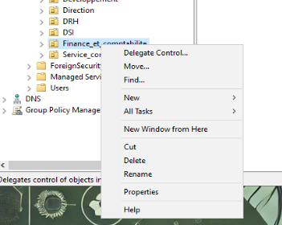

# SPRINT 6 USER GUIDE

## Mise à jour de l'AD

### Le département "Finance et Comptabilité" change de nom et s'appelle désormais  "Direction financière".
- Cette partie là a été traitée manuellement.
#### Renommer l'OU "Finance et Comptabilite".
- Selectioner l'OU "Finance et Comptabilite" et faire clic droit, puis `Rename`.\

- Renommer l'OU "Direction financiere".\


### Dans ce département, le service "Fiscalité" disparaît, et les collaborateurs intègrent le service "Finance".
- Cette partie là a été traitée manuellement.

#### Déplacer Compte Utilisateur.
- Sélectioner l'utilisateur et faire clic droit, puis `Move`.\

- Sélectionner l'OU où l'utilisateur doit être déplacé, puis OK.  \


#### Déplacer l'OU"Fiscalité" dans l'OU "Ecotech_A_Supprimer".
- Sélectioner l'OU "Fiscalité" et faire clic droit, puis `Move`.\

- Sélectionner l'OU "Ecotech_A_Supprimer" où il doit être déplacé, puis OK.  \


### Intégration des nouveaux utilisateurs.
- Nous avons utilisé un script avec un fichier CSV, les nouveaux entrants ont été intégrés à l'AD. \
[USER_Creation_Ecotechsolution.ps1](../Ressources/Scripts/USER_Creation_Ecotechsolution.ps1)\
[Liste_Employes_Entrant.csv](../Ressources/Scripts/Liste_Employes_Entrant.csv)

### Plusieurs collaborateurs ont quitté la société à la fin du mois dernier. Traiter leurs comptes AD ainsi que leurs données associées (s'il y en a).
#### Désactivation des comptes AD.
- Pour la désactivation des employés sortant nous avons d'abord créer un OU `Ecotech_A_Supprimer`, pour centraliser les utilisateurs.
- Pour traiter la désactivation et le déplacement dans cette OU nous passons par un script et un fichier csv. \
[USER_Désactivation_Ecotechsolution.ps1](../Ressources/Scripts/USER_Desactivation_Ecotechsolution.ps1)\
[Liste_Employes_Sortant.csv](../Ressources/Scripts/Liste_Employes_Sortant.csv)
- Vous Pouvez voire que les utilisateurs sont intégrés à l'OU "Ecotech_A_Supprimer", avec en description la date de désactivation.\

- l'OU `Ecotech_A_Supprimer` sera vidée une fois par mois via un script(en cours de réalisation), les dossiers personnels seront aussi supprimés.

### Des collaborateurs se sont marié. Traiter correctement leur nouveau nom.

- Cette partie là a été traitée manuellement.\
#### Renommer compte utilisateur.
-Sélectioner l'utilisateur et faire clic droit, puis `Rename`.\

- Renommer l'utilisateur. \

- Remplire les champs suivant la politique de l'AD.\

- **Attention! ne pas modifier les champs `User logon name`** 

### Gestion hiérarchique.

- Pour la gestion hiérarchique , nous avons utilisé un script avec un fichier CSV.\
[USER_Mise_a_jour_des_comptes_utilisateurs_automatique.ps1](../Ressources/Scripts/USER_Mise_a_jour_des_comptes_utilisateur_automatique.ps1)\
[Utilisateurs2.csv](../Ressources/Scripts/Utilisateurs2.csv)

## FAQ

-J'ai eu un soucis avec un nom d'utilisateur `Le Floch'`, qui m'a posé un problème sur le `SamAccountName`lors de l'exécution de mon script de mise à jour des comptes utilisateurs, il m'indiquait une erreur disant qu'il ne trouvait pas le SamAccountName, j'ai essayé de modifier mon script de création de nouveau utilisateur en enlevant les caractères spéciaux dans le SamAccountName et là je me suis aperçu que les premiers utilisateurs créé sur l'ad ne prennait pas en charge ce critère  et n'étais pas reconnu par mon script "mis à jour des comptes utilisateurs", du coup j'ai décidé de modifier mon fichier CSV pour retirer le "'" de  "Le Floch'", lors de la création de cette utilisateur, car c'était le seul cas que j'avais.

---

# Configuration de l'Interface de Zabbix

Dans votre navigateur, accédez à l'URL cible où Zabbix est en cours d'exécution, par exemple `http://192.168.0.50/zabbix`. Suivez l'assistant d'installation initiale pour configurer les paramètres requis, tels que la connexion à la base de données et les informations de base sur le serveur.

Connectez-vous ensuite avec les identifiants par défaut (**Admin/zabbix**) pour accéder au tableau de bord initial.

 Après avoir sélectionné la langue par défaut, cliquez sur **Étape suivante** pour accéder à la page de vérification des prérequis minimaux.


Si la vérification est réussie, cliquez sur **Étape suivante** pour accéder à la page des paramètres de connexion à la base de données.


Ici, remplissez uniquement le champ **Mot de passe** pour accéder à la base de données ; aucune autre modification n'est nécessaire.

Après avoir saisi le mot de passe, cliquez de nouveau sur **Étape suivante**.


Sur la page suivante, dédiée aux paramètres de base, renseignez le nom du serveur et le fuseau horaire, puis cliquez sur **Étape suivante** pour accéder au résumé de la configuration.


Dans ce résumé, examinez toutes les valeurs saisies, puis cliquez sur **Étape suivante** pour terminer l'installation.


Enfin, cliquez sur le bouton **Terminer** pour accéder à l'écran de connexion.


Après vous être connecté avec les identifiants précédemment configurés, vous pouvez commencer à utiliser la dernière version de Zabbix 7.2 (**Admin/zabbix**).


Voici à quoi ressemble le tableau de bord initial de la nouvelle version de Zabbix 7.2 :


---

# Installation et Configuration de Zabbix-agent2 sur Linux

## Installation

Vous pouvez installer le Zabbix-agent2 avec la commande suivante :

```bash
apt install zabbix-agent2
```

## Configuration de l'agent

Pour faire fonctionner l'agent, vous devez configurer certains paramètres de base.

Pour cela, ouvrez le fichier `zabbix_agent2.conf` avec votre éditeur de texte préféré :

```bash
nano /etc/zabbix/zabbix_agent2.conf
```

Ajustez les propriétés suivantes :

```plaintext
Server=<Indiquez ici le nom d'hôte de votre serveur ZABBIX>
ServerActive=<Indiquez ici le nom d'hôte de votre serveur ZABBIX>
Hostname=<Indiquez ici le nom d'hôte de votre serveur ACTUEL>
```

## Redémarrer Zabbix-agent2

Pour appliquer vos paramètres, redémarrez le Zabbix-agent2 avec la commande suivante :

```bash
systemctl restart zabbix-agent2
```
---

# Installation de Zabbix-Agent 2 sur Windows

## Récupération des sources d'installation

Pour télécharger le fichier d'installation .msi de l'agent suivre ce lien : [Agent 2](https://cdn.zabbix.com/zabbix/binaries/stable/7.2/7.2.2/zabbix_agent2-7.2.2-windows-amd64-openssl.msi)

## Installation de Zabbix Agent 2

Lancer l'installation, accepter les CGU, laisser tous les composants enfichables.

## Configuration du service 

Lorsque vous arrivez sur la fenêtre ci-dessous, indiquer le Hostname du serveur sur lequel vous êtes (souvent remplis par défaut).

- Saisir l'IP du server ZABBIX.
- Laisser le port par défaut.
- Saisir l'IP du server ZABBIX.
- Cocher **Add agent location to the PATH**


Terminer ensuite l'installation. 

## Vérification du service

Afin de s'assurer que l'installation s'est correctement effectuée et que le service est bien lancé aller regardez dans les services Windows si il est bien lancé. 


---

# Installation de Zabbix-Agent 2 sur Windows Core

## installation et configuration en PowwerShell

Après avoir récupérer les sources d'installation `.msi` exécuter la commande PowerShell suivante afin de lancer l'installation sur le serveur Windows Core.

```powershell
Start-Process -FilePath "msiexec.exe" -ArgumentList '/i "C:\users\administrator\downloads\zabbix_agent2-7.2.2-windows-amd64-openssl.msi" /quiet /norestart SERVER="<IP DU SERVEUR ZABBIX>" SERVERACTIVE="<IP DU SERVEUR ZABBIX>" HOSTNAME="<HOSTNAME DU SERVEUR CORE>"' -Wait
```

## Vérifier l’installation

Vérifiez que le service Zabbix Agent 2 est installé et fonctionne 

```Powershell
Get-Service -Name "Zabbix Agent 2"
```

Si le service n’est pas démarré 
```powershell
Start-Service -Name "Zabbix Agent 2"
```
