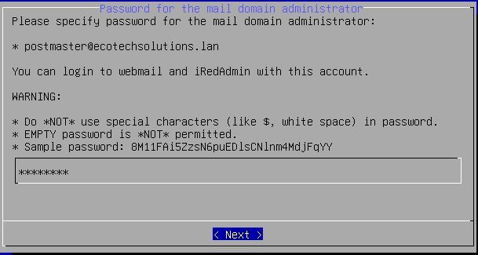
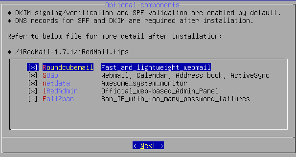

# SPRINT 7
## Mise en place d'un serveur de messagerie IRedMail

### Sommaire

1) Documentation

2) Installation


## 1. Documentation


**IVROGNE**
* Template : `Debian` / Type : `CT`.
* Configuration IP : `10.10.255.10/24` / Passerelle : `10.10.255.254` / Carte réseau : `vmbr555`.
* Hard Disk : `1 HDD 20GO` / SWAP `512MO` 
* Processeur : `1`.
* RAM : `4Go`.
* Fonction : `Serveur mail`. 
 
Avant de démarrer notre conteneur, nous allons sur le DNS manager de notre serveur DNS (ici *DORYPHORE*), *Forward Lookup Zones*, *ecotechsolutions.lan* pour :
 - Créer un **Host name A** ivrogne : 10.10.255.10\
 
 - Créer un **MX** : ivrogne : IVROGNE.ecotechsolutions.lan\
 
  
Nous démarrons alors le conteneur puis :
 - ``apt update && apt upgrade -y``
 - Dans le fichier ``/etc/hosts`` nous modifions pour écrire: \
 `-127.0.0.1 ivrogne.ecotechsolutions.lan  ivrogne  localhost  localhost.localdomain`\
 `-127.0.1.1 ivrogne.ecotechsolutions.lan`\
 
 - Dans le fichier `/etc/hostname` nous plaçons le nom en FQDN (Full Qualified Domain Name) \
 `-ivrogne`\
 
Faire un **reboot** du serveur.\
Vérifier si tous est bon en tapant `hostname -f`.\
 

## Installation

Nous pouvons alors procéder à l'installation de iRedMail. Voici les premiers pas :
  
 - Nous tapons la ligne de commande suivante : `wget https://github.com/iredmail/iRedMail/archive/refs/tags/1.7.1.tar.gz`.
 - Nous extrayons avec la commande suivante : `tar -xzf *.tar.gz`
 - On se rend dans le dossier iRedMail-* : `cd iRedMail-*`
 - Un fois placé dans ce dossier, nous exécutons le script : ``bash iRedMail.sh``
  
Nous voici alors en présence de l'assistant d'installation. 

Pour commencer l'installation, validez avec **< YES >**.


Pour le chemin du stockage du courrier, nous le laissons par défaut, continuez avec **< NEXT >**.


Pour le serveur web, sélectionnez **Nginx** et continuez avec **< NEXT >**.


Pour la base de donnée des mails, sélectionnez **OpenLDAP** et  continuez avec **< NEXT >**.


Pour le suffixe LDAP, entrez le domaine comme suit, continuez avec **< NEXT >**.


Saisissez le mot de passe Administrateur mail "_Azerty1*_" , continuez avec **< NEXT >**.


Saisissez le nom domaine comme suit, continuez avec **< NEXT >**.


Saisissez le mot de passe Administrateur "_Azerty1*_" , continuez avec **< NEXT >**.



Pour les options, sélectionnez: **_Roundcubemail_**,**_SOGo_**, **_netdata_**, **_iRedAdmin_** et **_Fail2ban_**. Continuez avec **< NEXT >**.



Nous avons un récapitulatif des paramètres de iRedmail, avec une question "continue? [y|N], si tous est bon **y** \


L'installation et la configuration sont terminées. 
Aux questions _File: /etc/nftables.conf, with SSHD ports: 22_ et _Restart firewall now (with ssh port: 22)?_ , validez les deux questions avec **y**.


Faire un **reboot** du serveur.

Connectons-nous à la page de connexion de _Roundcube Webmail_ avec l'adresse IP **10.10.255.10/mail/**. Saisissez le nom d'utilisateur "_postmaster@ecotechsolutions.lan_" et le mot de passe "_Azerty1*_" et cliquez sur **CONNEXION**.


Voici la page d'accueuil de _Roundcube Webmail_.


Connectons-nous à la page de connexion de _iRedAdmin_ avec l'adresse IP **10.10.255.10/iredadmin/**. Saisissez le nom d'utilisateur _postmaster@ecotechsolutions.lan_ et le mot de passe _Azerty1*_ et cliquez sur **CONNEXION**.


Pour Créer un utilisateur, allez sur l'onglet **+Ajouter**.


Pour créer l'utilisateur, remplir tout les champs contenant une étoile rouge et cliquez sur **Ajouter** en bas de page.


Une fois créee, vérifions en allant sur l'onglet **Domaines et Comptes**


Retournons sur la page d'accueuil de _Roundcube Webmail_ pour verifier que l'utilisateur crée apparait bien dans les contacts.


Créons un mail test vers notre nouveau contact et cliquez sur **Envoyer**.


Connectons-nous sur un compte créé précédemment.


Notre contact a bien reçu le mail test que nous avons envoyé.


La création et la configuration de l'adresse mail est operationelle.

---

# Installation serveur Passbolt

## Configuration du dépôt de paquets  

Pour faciliter l'installation et les mises à jour, Passbolt fournit un dépôt de paquets que vous devez configurer avant de télécharger et d'installer Passbolt CE.  

### **Étape 1.** Téléchargez notre script d'installation des dépendances :  

```bash
curl -LO https://download.passbolt.com/ce/installer/passbolt-repo-setup.ce.sh
```

### **Étape 2.** Téléchargez la somme de contrôle SHA512SUM pour le script d'installation :  

```bash
curl -LO https://github.com/passbolt/passbolt-dep-scripts/releases/latest/download/passbolt-ce-SHA512SUM.txt
```

### **Étape 3.** Vérifiez la validité du script et exécutez-le :  

```bash
sha512sum -c passbolt-ce-SHA512SUM.txt && sudo bash ./passbolt-repo-setup.ce.sh || echo "Checksum incorrect. Abandon." && rm -f passbolt-repo-setup.ce.sh
```

---

## Installation du package officiel de Passbolt pour Linux  

```bash
sudo apt install passbolt-ce-server
```

---

## Configuration de MariaDB  

1. Sauf indication contraire, le package Debian de Passbolt installera **mariadb-server** localement. Cette étape vous aidera à créer une base de données MariaDB vide pour que Passbolt puisse l'utiliser.  


2. La configuration vous demandera les identifiants de l’administrateur MariaDB pour créer une nouvelle base de données. Par défaut, l'identifiant administrateur est `root` et le mot de passe est vide dans la plupart des installations.
   
   

3. Ensuite, vous devez créer un utilisateur MariaDB avec des permissions réduites pour que Passbolt puisse s'y connecter. Ces informations seront également demandées plus tard dans l'outil de configuration web de Passbolt, alors gardez-les en mémoire.
   

4. Enfin, il faut créer une base de données que Passbolt utilisera. Vous devrez lui attribuer un nom.
   


---

## Configuration de Nginx pour servir en HTTP 

1. Afin d'avoir accès à l'interface web, il faut paramétrer nginx.
   

2. Nous ne configurerons pas de certificats SSL
   

3. Saisir enfin l'adresse du serveur passbolt. Ne pas saisir 127.0.0.1
   


---

## 2. Configuration de Passbolt  

Avant d'utiliser l'application, vous devez la configurer. Ouvrez votre navigateur et rendez-vous sur l'adresse IP 10.10.255.1 où Passbolt est accessible. Vous arriverez sur une page de démarrage.  


### **2.1. Vérification du système (Healthcheck)**  

La première page de l’assistant vérifiera si votre environnement est prêt pour Passbolt. Corrigez les éventuels problèmes et cliquez sur **"Démarrer la configuration"** lorsque vous êtes prêt.  

### **2.2. Configuration de la base de données**  

Indiquez à Passbolt les informations de connexion à la base de données :  
- Nom d'hôte  
- Numéro de port  
- Nom de la base de données  
- Identifiant et mot de passe de l’utilisateur MariaDB  


### **2.3. Clé GPG**  

Dans cette section, vous pouvez générer ou importer une paire de clés GPG. Cette clé servira à **authentifier l'API Passbolt** lors du processus de connexion.  


#### **Générer une nouvelle clé GPG**  

Si vous n’avez pas encore de clé GPG, utilisez cette commande :  

```bash
gpg --batch --no-tty --gen-key <<EOF  
Key-Type: default  
Key-Length: 3072  
Subkey-Type: default  
Subkey-Length: 3072  
Name-Real: Nom Utilisateur  
Name-Email: passboltadmin@ecotech.lan  
Expire-Date: 0  
%no-protection  
%commit  
EOF
```

Remplacez **Name-Real** par vos informations.

#### **Afficher votre clé GPG**  

```bash
gpg --armor --export-secret-keys email@domaine.tld
```

Importer la clé dans passbolt 


# Installation de Redmine sur un conteneur LXC sous Proxmox

## Prérequis

- Un serveur Proxmox avec accès administrateur.
- Une image Debian 12 pour LXC.
- Un accès internet pour récupérer les paquets nécessaires.
- Un conteneur LXC avec les paramètres suivants :
  - **Nom du conteneur** : `ACCAPAREUR`
  - **Propriétaire** : Groupe 2 (EcotechSolutions)
  - **OS** : Debian 12
  - **Login** : `root` ou `wilder`
  - **Mot de passe** : `Azerty1*`
  - **Adresse IP** : `10.10.255.9/24` (interface `vmbr555`)

## Création du Conteneur LXC

### Étape 1 : Création du conteneur

1. Se connecter à l'interface web de Proxmox.
2. Aller dans `Datacenter` → `Nœud Proxmox` → `CT`.
3. Cliquer sur `Créer CT` et remplir les champs :
   - **Nom du conteneur** : `ACCAPAREUR`
   - **Mot de passe** : `Azerty1*`
   - **Système d'exploitation** : Debian 12 (choisir un template téléchargé)
   - **Réseau** : IP statique `10.10.255.9/24`, passerelle selon votre configuration
4. Valider et démarrer le conteneur.

## Installation de Redmine

### Étape 2 : Connexion au conteneur

```bash
ssh root@10.10.255.9
```
Mot de passe : `Azerty1*`

### Étape 3 : Mise à jour et installation des prérequis

```bash
apt update && apt upgrade -y
apt install -y apache2 mariadb-server libapache2-mod-passenger \
           imagemagick libmagickwand-dev curl git
```

### Étape 4 : Installation de la base de données MariaDB

```bash
systemctl enable --now mariadb
mysql_secure_installation
```

Créer une base de données et un utilisateur pour Redmine :

```bash
mysql -u root -p <<EOF
CREATE DATABASE redmine CHARACTER SET utf8mb4;
CREATE USER 'redmine'@'localhost' IDENTIFIED BY 'RedminePass123';
GRANT ALL PRIVILEGES ON redmine.* TO 'redmine'@'localhost';
FLUSH PRIVILEGES;
EOF
```

### Étape 5 : Installation de Redmine

```bash
apt install -y redmine redmine-mysql
ln -s /usr/share/redmine/public /var/www/html/redmine
chown -R www-data:www-data /usr/share/redmine /var/www/html/redmine
```

Configurer Apache pour Redmine (`/etc/apache2/sites-available/redmine.conf`) :

```bash
<VirtualHost *:80>
    ServerAdmin admin@localhost
    DocumentRoot /var/www/html/redmine

    <Directory "/var/www/html/redmine">
        RailsEnv production
        PassengerResolveSymlinksInDocumentRoot on
    </Directory>

    ErrorLog ${APACHE_LOG_DIR}/redmine_error.log
    CustomLog ${APACHE_LOG_DIR}/redmine_access.log combined
</VirtualHost>
```

Activer le site et redémarrer Apache :

```bash
a2ensite redmine.conf
a2enmod passenger
systemctl restart apache2
```

## Accès à Redmine

Une fois l’installation terminée, accéder à l’interface web :

```
http://10.10.255.9/redmine
```

- **Login** : `admin`
- **Mot de passe** : `admin`
