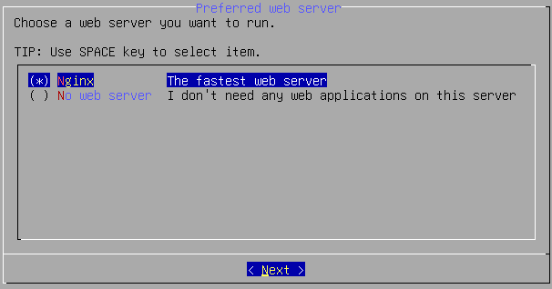
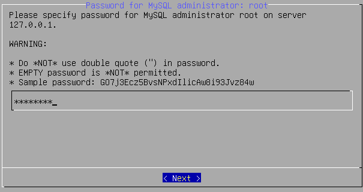
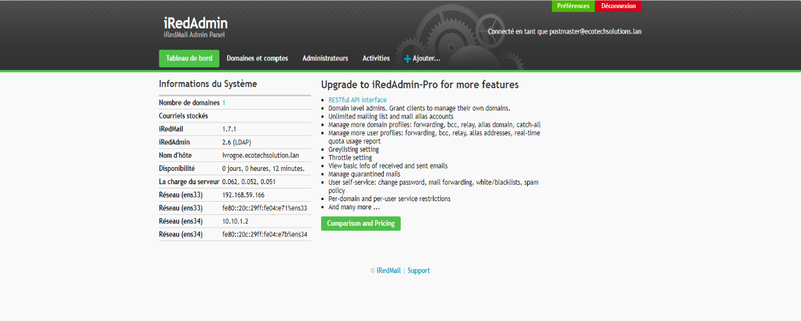

# SPRINT 7
## Mise en place d'un serveur de messagerie IRedMail

### Sommaire

1) Documentation

2) Installation

## 1. Documentation

**IVROGNE**
* Template : `Debian` / Type : `CT`.
* Configuration IP : `10.10.255.10/24` / Passerelle : `10.10.255.254` / Carte réseau : `vmbr555`.
* Hard Disk : `1 HDD 20GO` / SWAP `512MO` 
* Processeur : `1`.
* RAM : `4Go`.
* Fonction : `Serveur mail`. 
 
Avant de démarrer notre conteneur, nous allons sur le DNS manager de notre serveur DNS (ici *DORYPHORE*), *Forward Lookup Zones*, *ecotechsolutions.lan* pour :
 - Créer un **Host name A** ivrogne : 10.10.255.10\
 
 - Créer un **MX** : ivrogne : IVROGNE.ecotechsolutions.lan\
 
  
Nous démarrons alors le conteneur puis :
 - ``apt update && apt upgrade -y``
 - Dans le fichier ``/etc/hosts`` nous modifions pour écrire: \
 `-127.0.0.1 ivrogne.ecotechsolutions.lan  ivrogne  localhost  localhost.localdomain`\
 `-127.0.1.1 ivrogne.ecotechsolutions.lan`\
 
 - Dans le fichier `/etc/hostname` nous plaçons le nom en FQDN (Full Qualified Domain Name) \
 `-ivrogne`\
 
Faire un **reboot** du serveur.\
Vérifier si tous est bon en tapant `hostname -f`.\
 

## Installation

Nous pouvons alors procéder à l'installation de iRedMail. Voici les premiers pas :
  
 - Nous tapons la ligne de commande suivante : `wget https://github.com/iredmail/iRedMail/archive/refs/tags/1.7.1.tar.gz`.
 - Nous extrayons avec la commande suivante : `tar -xzf *.tar.gz`
 - On se rend dans le dossier iRedMail-* : `cd iRedMail-*`
 - Un fois placé dans ce dossier, nous exécutons le script : ``bash iRedMail.sh``
  
Nous voici alors en présence de l'assistant d'installation. 

Pour commencer l'installation, validez avec **< YES >**.

Pour le chemin du stockage du courrier, nous le laissons par défaut, continuez avec **< NEXT >**.

Pour le serveur web, sélectionnez **Nginx** et continuez avec **< NEXT >**.

Pour la base de donnée des mails, sélectionnez **OpenLDAP** et  continuez avec **< NEXT >**.

Pour le suffixe LDAP, entrez le domaine comme suit, continuez avec **< NEXT >**.

Saisissez le mot de passe Administrateur mail "_Azerty1*_" , continuez avec **< NEXT >**.

Saisissez le nom domaine comme suit, continuez avec **< NEXT >**.

Saisissez le mot de passe Administrateur "_Azerty1*_" , continuez avec **< NEXT >**.

Pour les options, sélectionnez: **_Roundcubemail_**,**_SOGo_**, **_netdata_**, **_iRedAdmin_** et **_Fail2ban_**. Continuez avec **< NEXT >**.

Nous avons un récapitulatif des paramètres de iRedmail, avec une question "continue? [y|N], si tous est bon **y** \

L'installation et la configuration sont terminées. 
Aux questions _File: /etc/nftables.conf, with SSHD ports: 22_ et _Restart firewall now (with ssh port: 22)?_ , validez les deux questions avec **y**.

Faire un **reboot** du serveur.

Connectons-nous à la page de connexion de _Roundcube Webmail_ avec l'adresse IP **10.10.255.10/mail/**. Saisissez le nom d'utilisateur "_postmaster@ecotechsolutions.lan_" et le mot de passe "_Azerty1*_" et cliquez sur **CONNEXION**.

Voici la page d'accueuil de _Roundcube Webmail_.

Connectons-nous à la page de connexion de _iRedAdmin_ avec l'adresse IP **10.10.255.10/iredadmin/**. Saisissez le nom d'utilisateur _postmaster@ecotechsolutions.lan_ et le mot de passe _Azerty1*_ et cliquez sur **CONNEXION**.

Pour Créer un utilisateur, allez sur l'onglet **+Ajouter**.

Pour créer l'utilisateur, remplir tout les champs contenant une étoile rouge et cliquez sur **Ajouter** en bas de page.

Une fois créee, vérifions en allant sur l'onglet **Domaines et Comptes**

Retournons sur la page d'accueuil de _Roundcube Webmail_ pour verifier que l'utilisateur crée apparait bien dans les contacts.

Créons un mail test vers notre nouveau contact et cliquez sur **Envoyer**.

Connectons-nous sur un compte créé précédemment.

Notre contact a bien reçu le mail test que nous avons envoyé.

La création et la configuration de l'adresse mail est operationelle.

Après avoir déployé par **GPO**, l'installation du logiciel **Thunderbird** sur nos postes clients.\
Nous nous rendons sur le poste client *cdupont*  de notre domaine.

Une fois Thunderbird ouvert, nous procédons aux réglages suivants (de telle sorte à "lier" le serveur mail à notre client mail installé sur le poste; cela permet d'éviter à l'utilisateur de se rendre directement sur le serveur pour consulter ses emails) :
  
On se rend dans **Paramètres** > **Paramètres des comptes** > **Paramètres serveur** : ici nous spécifions le nom DNS de notre serveur mail (conteneur IVROGNE),*ivrogne.ecotechsolutions.lan* qui écoute sur le port 143 (IMAP non sécurisé).Nous validons :

  
Ce qui génère un redémarrage de l'application pour tenir compte des modifications. Nous entrons le mot de passe de l'utilisateur en question :

  
Nous avons connecté le client au serveur mail !

