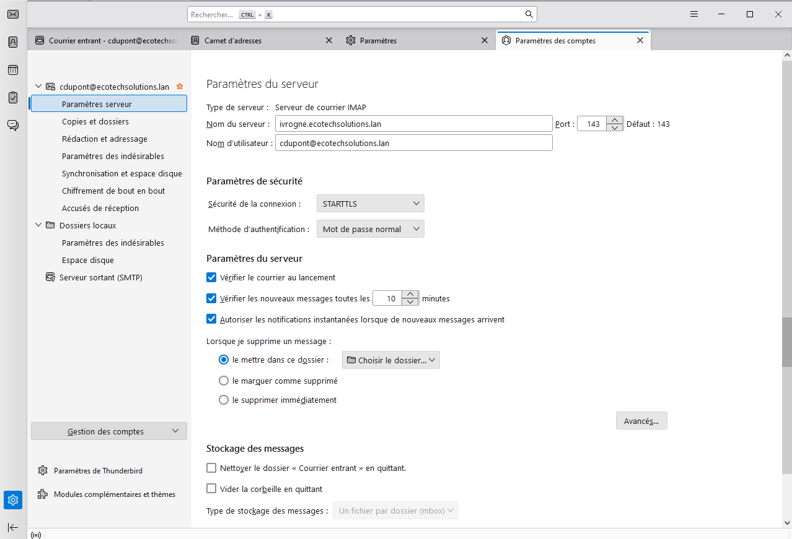
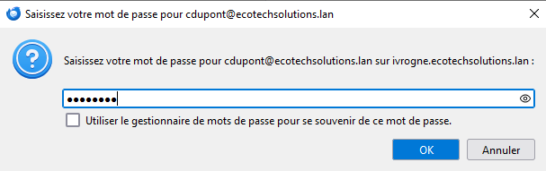
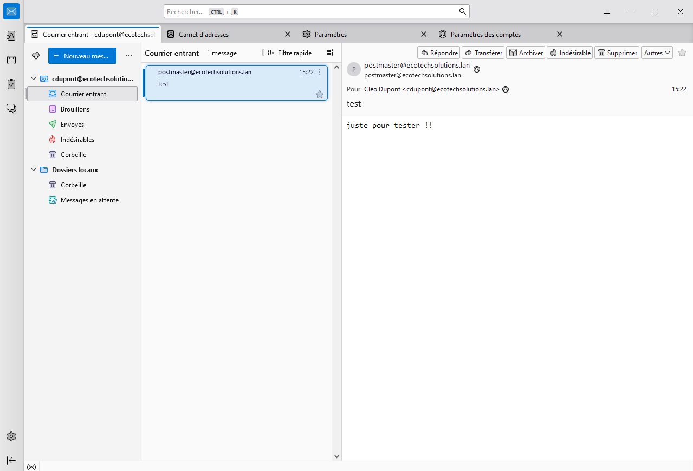

# SPRINT 7 USER GUIDE

# 📘 Guide Utilisateur Redmine

## 🔹 Introduction
Redmine est une plateforme de gestion de projet open-source, permettant le suivi des tâches, la gestion des utilisateurs et la collaboration entre équipes.

🔗 **Documentation officielle** : [Redmine User Guide](https://www.redmine.org/projects/redmine/wiki/User_Guide)  

---

## 🛠️ **1. Prise en main**
### 🔑 Connexion & Création de compte
1. Accédez à l'URL de votre instance Redmine.
2. Connectez-vous avec vos identifiants.
3. Personnalisez votre page d’accueil via **Mon compte**.

### 🏗️ Vue d’ensemble des projets
- **Accéder aux projets** via la barre de navigation.
- **Filtrer et rechercher des projets** via la section *Projets*.

---

## ✅ **2. Gestion des Tickets (Issues)**
### 📌 Création d’un ticket
1. Aller dans un projet.
2. Cliquer sur **Nouveau Ticket**.
3. Renseigner :
   - **Sujet**
   - **Description**
   - **Priorité**
   - **Statut** (*Nouveau, En cours, Terminé…*)
4. Assigner à un membre et **Enregistrer**.

### 🔍 Suivi et mise à jour des tickets
- Modifier un ticket en cliquant sur **Modifier**.
- Ajouter des **commentaires** et **fichiers joints**.
- Modifier le **statut** et la **priorité** si nécessaire.

---

## ⏳ **3. Gestion du Temps & Suivi**
### ⏲️ Saisie du temps passé
1. Aller sur un ticket.
2. Cliquer sur **Ajouter une entrée de temps**.
3. Saisir le nombre d’heures passées et une note.

### 📊 Génération de rapports
- **Rapports de temps** accessibles via *Activité > Temps passé*.
- Filtrage par **utilisateur, période, projet**.

---

## 📅 **4. Planification & Collaboration**
### 📆 Diagramme de Gantt
- Visualiser les tâches et leur avancement.
- Modifier les échéances directement.

### 📝 Wiki & Documents
- Ajouter des pages wiki pour documenter le projet.
- Joindre des fichiers sous **Documents**.

---

## 🔧 **5. Administration**
### 👤 Gestion des utilisateurs et permissions
- Ajouter de nouveaux utilisateurs via **Administration > Utilisateurs**.
- Définir les rôles et permissions sous **Rôles et Permissions**.

### ⚙️ Configuration des projets
- Activer/Désactiver des modules.
- Gérer les workflows de tickets.

---

## 📌 **Ressources utiles**
📖 [Guide utilisateur officiel](https://www.redmine.org/projects/redmine/wiki/User_Guide)  

# Guide Utilisateur iRedMail
Après avoir déployé par **GPO**, l'installation du logiciel **Thunderbird** sur nos postes clients.\
Nous nous rendons sur le poste client *cdupont*  de notre domaine.

Une fois Thunderbird ouvert, nous procédons aux réglages suivants (de telle sorte à "lier" le serveur mail à notre client mail installé sur le poste; cela permet d'éviter à l'utilisateur de se rendre directement sur le serveur pour consulter ses emails) :
  
On se rend dans **Paramètres** > **Paramètres des comptes** > **Paramètres serveur** : ici nous spécifions le nom DNS de notre serveur mail (conteneur IVROGNE),*ivrogne.ecotechsolutions.lan* qui écoute sur le port 143 (IMAP non sécurisé).Nous validons :

  
Ce qui génère un redémarrage de l'application pour tenir compte des modifications. Nous entrons le mot de passe de l'utilisateur en question :

  
Nous avons connecté le client au serveur mail !

