# SPRINT 8 USER GUIDE

# TRANSFERT DES RÔLES FSMO.

## Sommaire

1) Documentation

2) Transfert des rôles FSMO avec NTDSUTIL


# 1. Documentation

- Pour effectuer les transferts des rôles FSMO, nous nous sommes renseignés sur celles-ci via les recommandations de 
[Microsoft](https://learn.microsoft.com/fr-fr/troubleshoot/windows-server/active-directory/fsmo-placement-and-optimization-on-ad-dcs).
- Nous avons décidé de laisser les rôles : contrôleur de schéma, maître d'attribution des noms de domaine et maître d'infrastructure sur notre PDC. Le maître RID et l'émulateur PDC seront dispatchés sur deux autres DC.

## Transfert des rôles FSMO avec NTDSUTIL

Pour accéder à l'outil NTDSUTIL sur un contrôleur de domaine Active Directory, il suffit d'appeler "ntdsutil.exe" depuis une invite "Exécuter" ou de lancer l'outil à partir d'une invite de commande ou d'une console PowerShell. C'est un outil qui s'utilise en mode interactif.\
`ntdsutil.exe`\
 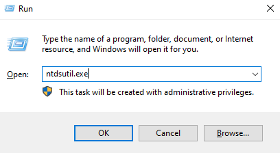\
Pour obtenir de l'aide quant à l'utilisation de NTDSUTIL, il suffit de saisir ? et vous verrez les commandes disponibles. Toujours utile en cas d'oubli.\
 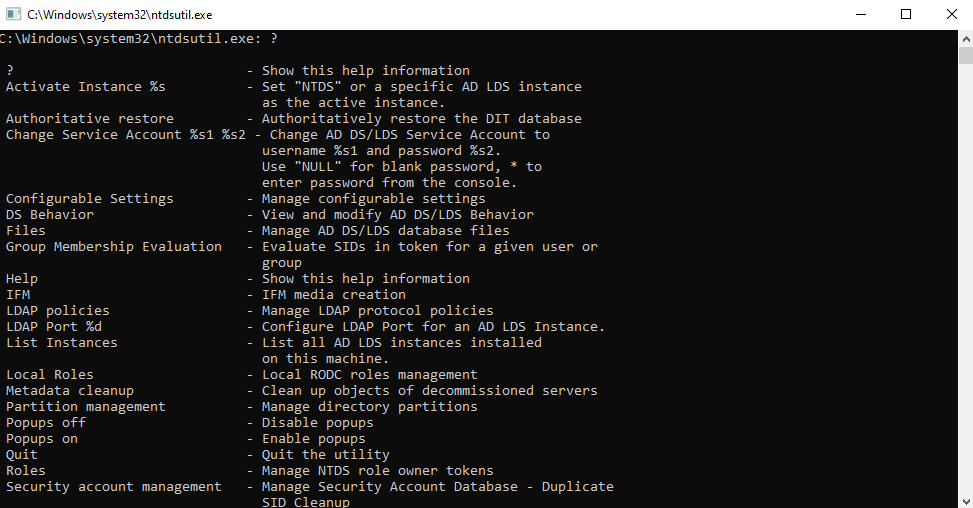\
La première étape consiste à activer le mode maintenance FSMO. Pour passer en mode "fsmo maintenance", il faut saisir la commande suivante :`role`.\
 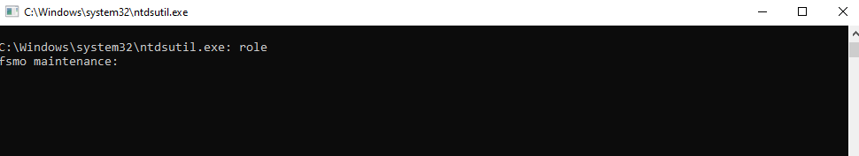\
Ensuite, pour voir les commandes disponibles, c'est le même principe que celui évoqué précédemment : il suffit de saisir ? pour afficher les commandes disponibles.\
 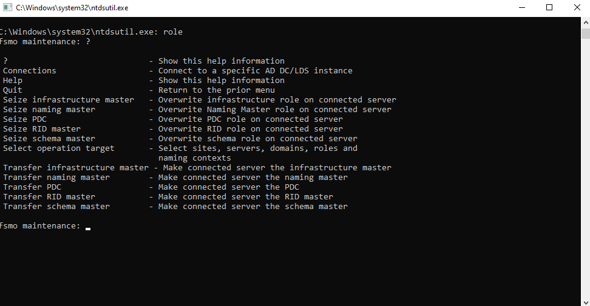\
Il faut établir une connexion avec le serveur sur lequel on veut transférer un ou plusieurs rôles. Pour cela, dans le mode « fsmo maintenance », tapez la commande suivante :`connections`
Vous êtes désormais en mode « server connections ». Pour établir la connexion avec le serveur, tapez la commande suivante en remplaçant <nom_du_serveur> par le nom du serveur :`connect to server OLIBRIUS`.\
 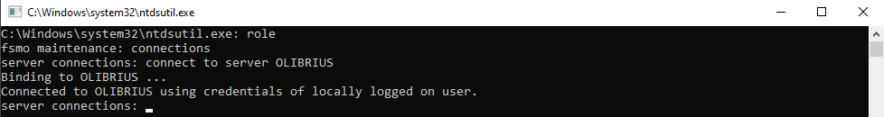\
Patientez le temps que la connexion soit établie. Quand c'est fait, vous pouvez quitter le mode connexion pour revenir au mode précédent. Tapez simplement ceci :`q`\
 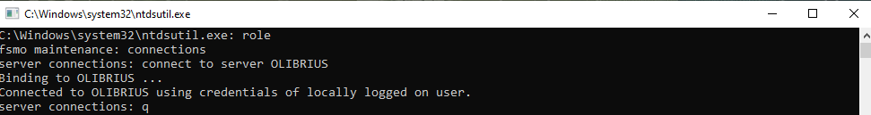\
Vous voilà de retour en mode fsmo maintenance. Désormais, nous allons voir comment transférer le rôle RID sur notre serveur.

- **Transférer le rôle de Maître RID**\
il faut saisir la commande suivante : `transfer RID master`\
 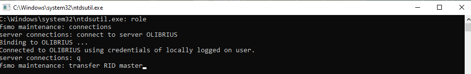\
Une fenêtre va s'ouvrir pour confirmer votre choix. Validez en cliquant sur **Yes**.
 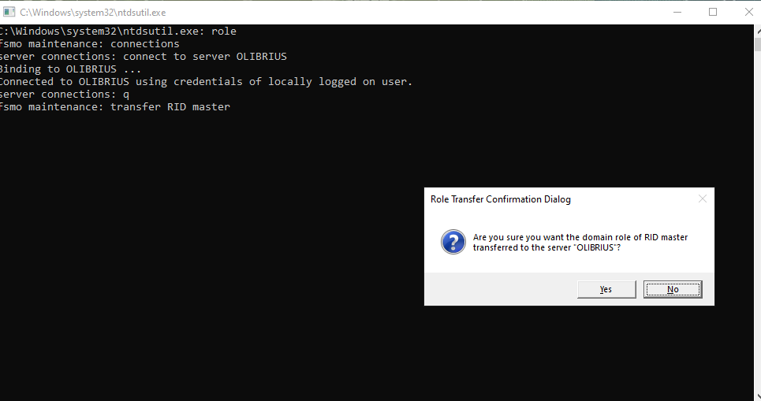\
Vous pourrez voir que le rôle a bien été transféré.\
 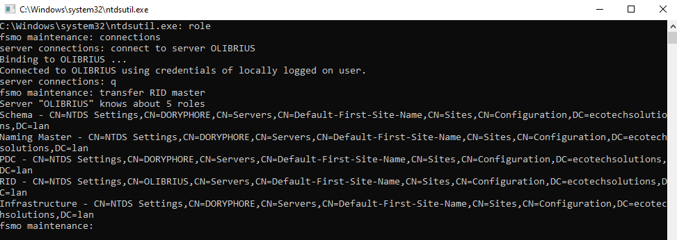

**Changer de serveur en refaisant les commandes de connexion**\
Il faut établir une connexion avec le serveur sur lequel on veut transférer un ou plusieurs rôles. Pour cela, dans le mode « fsmo maintenance », tapez la commande suivante :`connections`
Vous êtes désormais en mode « server connections ». Pour établir la connexion avec le serveur, tapez la commande suivante en remplaçant <nom_du_serveur> par le nom du serveur :`connect to server BIDULE`.
 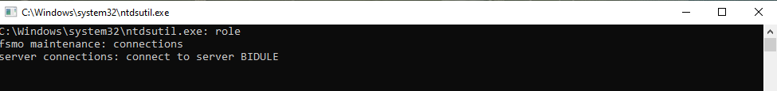\
Patientez le temps que la connexion soit établie. Quand c'est fait, vous pouvez quitter le mode connexion pour revenir au mode précédent. Tapez simplement ceci :`q`

- **Transfert du rôle d’Émulateur PDC**\
Il faut saisir la commande suivante :`transfer pdc`\
 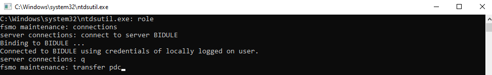\
Une fenêtre va s'ouvrir pour confirmer votre choix. Validez en cliquant sur **Yes**.
 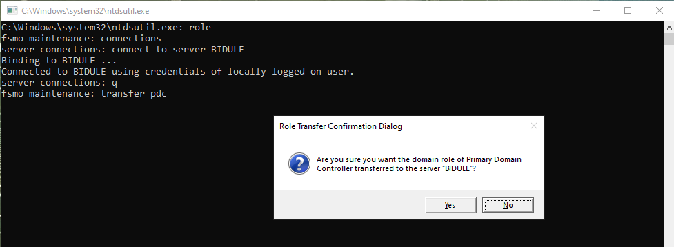\
Vous pourrez voir que le rôle a bien été transféré.\
 


Voilà, l'opération est terminée ! Pour quitter correctement le programme NTDSUTIL, saisissez q dans le mode fsmo maintenance, puis une fois sur l'invite de commande NTDSUTIL.

Enfin, vous pouvez vérifier si les rôles sont bien transférés grâce à la commande suivante sur PowerShell :`NETDOM QUERY /Domain:ecotechsolutions.lan FSMO`\
 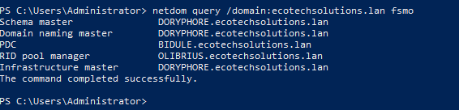


 # 📘 Guide Utilisateur WSUS (Windows Server Update Services)

## 🔹 Introduction
WSUS (Windows Server Update Services) est une solution Microsoft permettant de centraliser, gérer et distribuer les mises à jour Windows sur un réseau d’entreprise.

🔗 **Documentation officielle** : [WSUS Microsoft Docs](https://docs.microsoft.com/en-us/windows-server/administration/windows-server-update-services/get-started/windows-server-update-services-wsus)  

---

## ✅ **1. Gestion des Mises à Jour**
### 🔄 Synchronisation des mises à jour
- Accéder à **WSUS Console > Options > Source et synchronisation des mises à jour**.
- Lancer une **synchronisation manuelle** ou planifier des synchronisations automatiques.
- Vérifier l’état des mises à jour dans **Mises à jour > Toutes les mises à jour**.

### 📌 Approuver les mises à jour
1. Aller dans **WSUS Console > Mises à jour > Toutes les mises à jour**.
2. Filtrer par **État** (*Non approuvé, Approuvé, En attente*).
3. Sélectionner une ou plusieurs mises à jour.
4. Cliquer sur **Approuver** et choisir les groupes d’ordinateurs cibles.

### ⏳ Planification des mises à jour
- Appliquer une **stratégie de groupe (GPO)** pour forcer les clients à récupérer les mises à jour WSUS.
- Définir un planning de mise à jour dans **Stratégie de groupe > Windows Update**.

---

## 🖥️ **2. Gestion des Ordinateurs Clients**
### 🖧 Affichage des clients WSUS
- Aller dans **WSUS Console > Ordinateurs**.
- Regrouper les ordinateurs selon les stratégies définies (ex. *Postes de travail, Serveurs*).

### 🔍 Vérification de la connexion des clients
- Sur un poste client, exécuter :  
  ```powershell
  wuauclt /detectnow
  wuauclt /reportnow
  ```
- Vérifier l’état de mise à jour dans **WSUS Console > Ordinateurs**.

---

## 📊 **3. Surveillance et Rapports**
### 📈 Générer un rapport de mises à jour
1. Aller dans **WSUS Console > Rapports**.
2. Sélectionner **Résumé des mises à jour** ou **Statut des ordinateurs**.
3. Générer et exporter en **CSV, PDF**.

### 🚨 Gérer les erreurs et échecs de mises à jour
- Vérifier les **logs WSUS** dans :  
  `C:\Program Files\Update Services\LogFiles\`
- Consulter l’**Observateur d’événements** sur le serveur WSUS (`eventvwr.msc`).

---

## 🔧 **4. Maintenance et Nettoyage**
### 🗑️ Nettoyage de WSUS
- Exécuter l’outil **WSUS Cleanup Wizard** pour :
  - Supprimer les mises à jour obsolètes.
  - Nettoyer la base de données WSUS.

### 🚀 Optimisation et dépannage
- Exécuter :  
  ```powershell
  wsusutil.exe reset
  ```
- Défragmenter la base de données si WSUS devient lent.

---

## 📌 **Ressources utiles**
📖 [Documentation WSUS](https://docs.microsoft.com/en-us/windows-server/administration/windows-server-update-services/get-started/windows-server-update-services-wsus)  
📖 [Forum WSUS](https://learn.microsoft.com/en-us/answers/topics/windows-server-update-services.html)
