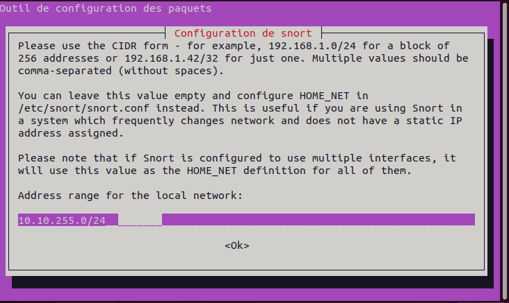
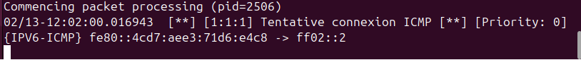
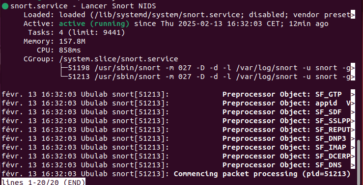

# SPRINT 11 INSTALL
## Mise en place d’un IDS: Snort
### Installation
Nous allons maintenant passer à l’installation de Snort, lors de ce tutoriel je vais installer celui-ci sur Ubuntu 


Commencez par mettre à jour votre système, ouvrez un terminal et tapez les deux commandes suivantes:

`sudo apt update && sudo apt upgrade -y`
 

Une fois le système mis à jour, nous allons installer Snort, pour cela tapez la commande suivante:

`sudo apt install snort`
 

Vous allez arriver sur l’assistant de configuration de **Snort**, faites « Entrer » sur la fenêtre de présentation. Vous devez ensuite renseigner la plage IP de votre réseau au format CIDR:



 

L’outil va vous demander une seconde fois l’interface à écouter, renseignez ce champ à nouveau. Patientez quelques secondes pour que l’installation se termine.

 

### Configuration
Comme je vous l’ai expliqué un peu plus haut, nous allons devoir configurer les règles pour lesquelles notre outil devra émettre une alerte. Deux choix s’offrent à vous, soit définir les règles vous-même ou télécharger des règles sur le site de Snort afin d’être protégé contre les menaces connues. Vous pouvez bien entendu combiner les deux.

 

### Règles manuelles
Pour définir des règles manuellement, éditez le fichier « local.rules » avec la commande suivante:

`sudo nano /etc/snort/rules/local.rules`
 

A la fin du fichier, ajoutez la ligne suivante:

`alert icmp any any -> $HOME_NET any (msg:"Tentative connexion ICMP"; sid:00001; rev:1;)`
 

Grâce à cette commande, **Snort** va générer à chaque requête ICMP (echo et reply) une alerte. Nous avons appliqué cette alerte, de tous les hôtes vers tous les hôtes (any any), msg est le message qui sera affiché dans l’alerte, sid est un identifiant qui doit être unique.

Nous allons vérifier que notre alerte fonctionne bien. Lancez l’outil **Snort** avec la commande suivante (pensez à adapter le nom de l’interface si elle est différente de eth0):

`snort -A console -i esn18 -u snort -c /etc/snort/snort.conf`
 

Lancez un ping a partir de n’importe quelle machine de votre réseau, comme expliqué précédemment Snort est un sniffer réseau, il va aspirer l’ensemble du trafic de votre réseau. Vous devriez voir l’alerte que nous venons de créer apparaître:



 

Appuyez sur Ctrl + C pour stopper **Snort**. L’ensemble des alertes/logs de l’outil sont stockés dans /var/log/snort. Pour accéder à un fichier de log, exécutez la commande suivante:

`snort -r /var/log/snort/snort.log.XXXXXX`
 

### Règles Snort

Pour utiliser les règles présentes sur le site de Snort, [cliquez ici](https://snort.org/downloads/#rule-downloads). Téléchargez le fichier correspondant à la version installée. Décompressez le fichier avec la commande suivante en remplaçant XXX par le nom du fichier:

`sudo tar zxvf XXX`
 

Allez dans le dossier décompressé et déplacez ensuite le fichier « community.rules« dans le répertoire contenant les règles de Snort:

`cd <DOSSIER_DECOMP>`

`sudo mv community-rules /etc/snort/rules`
 

Si vous éditez le fichier, vous remarquerez que l’ensemble est commenté. Bien entendu, vous devez décommenter uniquement les règles dont vous utilisez le protocole. (Inutile de générer des alertes sur le protocole POP si vous ne l’utilisez pas par exemple)

Nous allons maintenant indiquer à l’outil qu’il doit prendre en compte le fichier « community.rules » pour générer des alertes. Nous n’avions pas eu à faire cette opération pour la création de l’alerte du précédant point, car celle-ci était déjà présente dans le fichier de configuration par défaut. Utilisez la commande suivante:

`sudo nano /etc/snort/snort.conf`
 

Ajoutez la ligne suivante au fichier

`include $RULE_PATH/community.rules`
 

Sauvegardez et quittez. Le fichier contenant ces règles sera désormais pris en compte par Snort.

 

### Snort en tâche de fond
Vous pouvez lancer **Snort** en tâche de fond (service) pour cela nous allons créer un script de démarrage. Créez le fichier suivant:

`sudo nano /lib/systemd/system/snort.service`
 

Dans ce fichier, entrez ce texte (n’oubliez pas d’adapter le nom de l’interface à votre cas):
```
[Unit]
Description=Lancer Snort NIDS
After=syslog.target network.target

[Service]
Type=simple
ExecStart=/usr/local/bin/snort -q -u snort -g snort -c /etc/snort/snort.conf -i eth0

[Install]
WantedBy=multi-user.target
```
 

Sauvegardez le fichier et redémarrez systemctl qui est l’outil de gestion des services:

`sudo systemctl daemon-reload`
 

Démarrez le service Snort que vous venez de créer

`sudo systemctl start snort`
 

Vérifiez le statut du service:

`sudo systemctl status snort`


